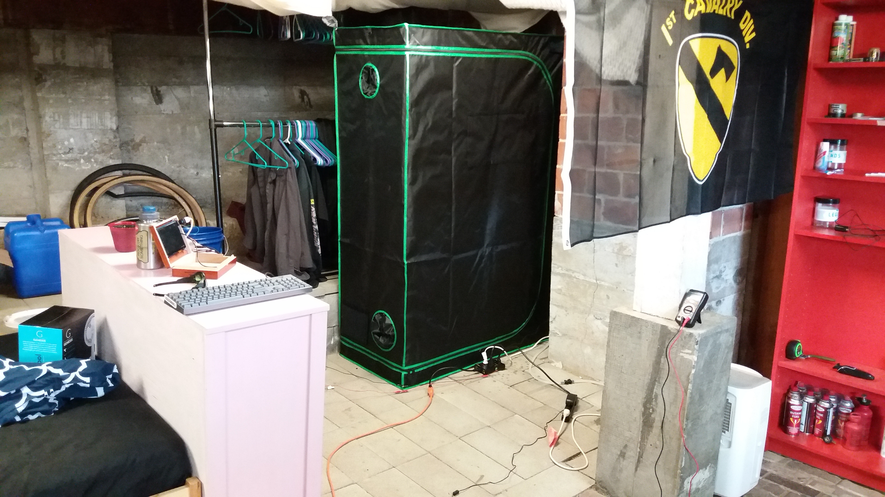
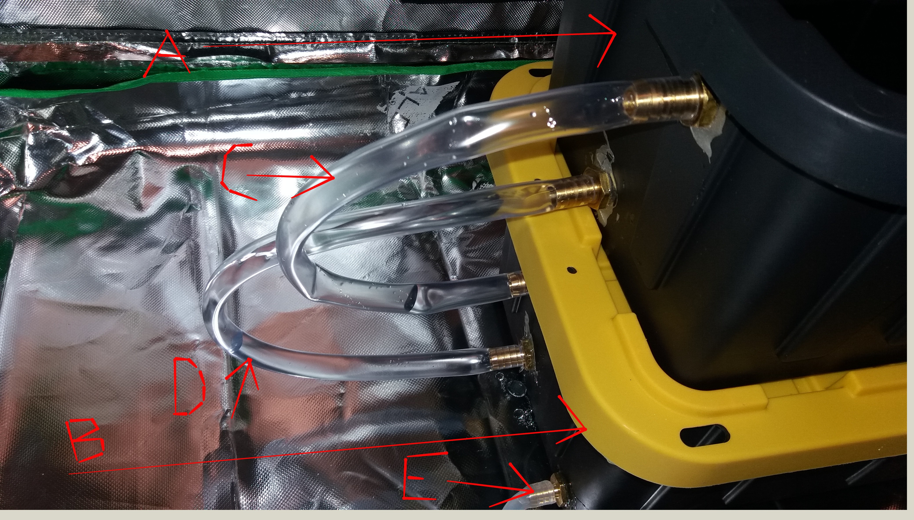
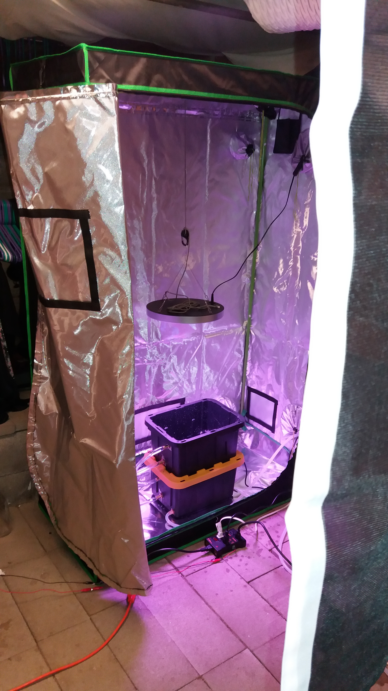
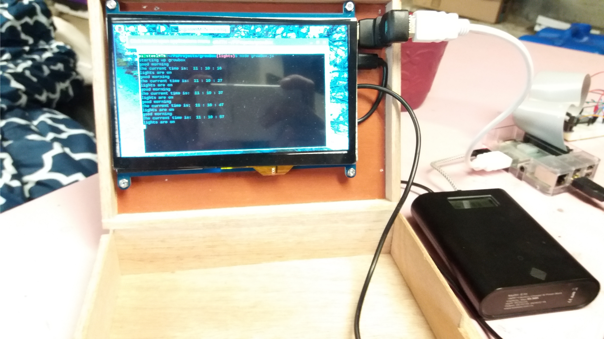
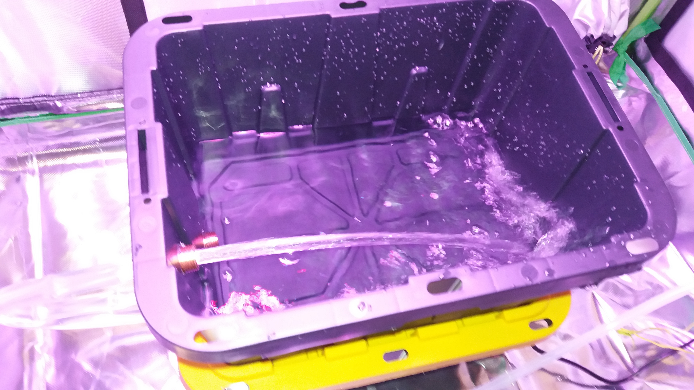

#  Growbox

##  Automated passive hydroponic growing environment controller

Using a Raspberry Pi and NodeJS, this app will allow for timing control of various relay controlled devices.

##  Working Functionality
  - Right now, just the light timer.  I tested the pump relays with pushbuttons but haven't automated them yet.

##  To Be Added
  - automate pumps
  - add ADC (possibly with arduino controller) and sensor inputs
  - create express server to interact with API
  - create front end (and host it somewhere) to monitor API
  - protect routes with OAuth
  - add ability to remotely override automation settings, or to manually perform single operations
    (e.g. 'turn off lights 1 hour earlier every day' vs. 'give the plants an extra watering right now but don't alter normal automation processes')
  - add state so the app maintains overall awareness of its sensors and timers
  - integrate db so it can store/access historical data
  - add notebook feature

###  Build Instructions

After cloning the repo, type `npm i` to install all of the necessary dependencies and quite a few that aren't being used for anything, then `node growBox.js` to run the scripts.

###  Pictures

Setup:

Water connections:
A)  Plant/Grow Medium
B)  Reservoir/pump
C)  Input for A
D)  Excess water in A drains back into B
E)  Drain hose for changing reservoir

Inside of tent with lights on:

Console output:

Water running:

